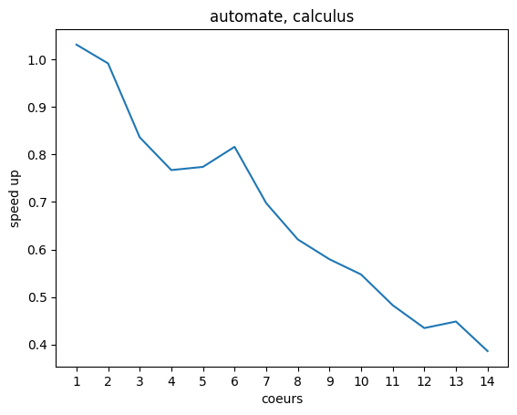
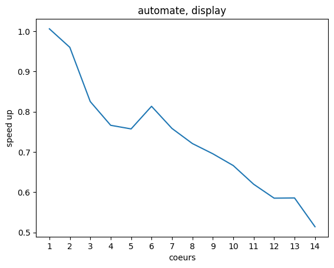

# examen OS202

## caracteristiques ordinateur:
voici les configurations de mon ordinateur optenus avec le commande `lscpu`:
```bash
Architecture:            x86_64
  CPU op-mode(s):        32-bit, 64-bit
  Address sizes:         39 bits physical, 48 bits virtual
  Byte Order:            Little Endian
CPU(s):                  20
  On-line CPU(s) list:   0-19
Vendor ID:               GenuineIntel
  Model name:            12th Gen Intel(R) Core(TM) i7-12700H
    CPU family:          6
    Model:               154
    Thread(s) per core:  2
    Core(s) per socket:  14
    Socket(s):           1
    Stepping:            3
    CPU max MHz:         4700.0000
    CPU min MHz:         400.0000

...
Caches (sum of all):     
  L1d:                   544 KiB (14 instances)
  L1i:                   704 KiB (14 instances)
  L2:                    11.5 MiB (8 instances)
  L3:                    24   MiB (1 instance)
...
```
donc on peut voir que ma machine a **14 coeurs physiques**, **20 coeurs logiques** et **11.5 MiB de L2** et **24 MiB de L3**.

## parallélisation
### automate
comme explique sur le code, le MPI a été choisit d'une façon a divise les diviser le range de `num_config` entre chaque processus à partir de son `rank` et de la quantité `size` de processus et donc chaque processus ferait une partie du calcule avec un intervale presque égale entre tous.

ce méthode static a été choisit pour éviter trop de communication entre les différents processus. 

on considère les valeurs suivants:

|code|calculus|display|
|----|--------|-------|
|sequential| 0.493569 | 4.18239 |
| MPI 1 [1] | 0.47856 | 4.15806 |
| MPI 1 [2] | 0.497646 | 4.35715 |
| MPI 1 [3] | 0.590201 | 5.06848 |
| MPI 1 [4] | 0.643329 | 5.45879 |
| MPI 1 [5] | 0.637732 | 5.52364 |
| MPI 1 [6] | 0.604732 | 5.14211 |
| MPI 1 [7] | 0.707489 | 5.51497 |
| MPI 1 [8] | 0.794551 | 5.80232 |
| MPI 1 [9] | 0.851778 | 6.01414 |
| MPI 1 [10] | 0.901597 | 6.2786 |
| MPI 1 [11] | 1.02255 | 6.74906 |
| MPI 1 [12] | 1.13577 | 7.14743 |
| MPI 1 [13] | 1.10085 | 7.14173 |
| MPI 1 [14] | 1.27833 | 8.1337 |

qui donne la figure suivante:




on note que l'utilisation de MPI a rendu le speed up de plus en plus petit au fur et à mesure que des coeurs étaient ajoutes. cela peut indiquer que la division des données sur plusieurs threads, dans ce cas, n'est pas efficace car la quantité de mémoire utilise est significative.

comme les communications entre les différents processus est petit, il y a seulement 2 `MPI.COMM_WORLD.Reduce()` utilises, ce facteur probablement n'influence pas trop la performance du code. 

la simulation a été fait avec le script bash suivant.
```bash
#!/bin/sh
M=( 1 2 3 4 5 6 7 8 9 10 11 12 13 14)

for m in ${M[@]}
do
    mpirun -n $m /bin/python3 /home/tr0fin0/Documents/git_repositories/OS202_2023_examen/ExamenOS202_21Mars2023/automate_cellulaire_1d.py
done
```


### enveloppe
initialement il faudrait avoir une division entre les différents pour diviser le calcule de chaque ensemble de nuages mais comme la définition de l'enveloppe depende de tous les points je n'arrive pas a voir comment parallélise le code d'un façon que les processus puissent comuniquer les différents limites qu'ils ont.

on considère les valeurs suivants:
|code|generation|calcul|
|----|--------|-------|
|sequential| 0.013231 | 0.301917 |

